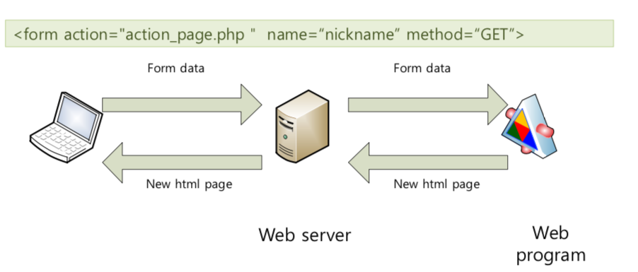
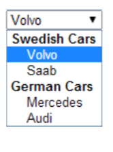
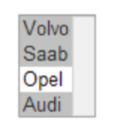
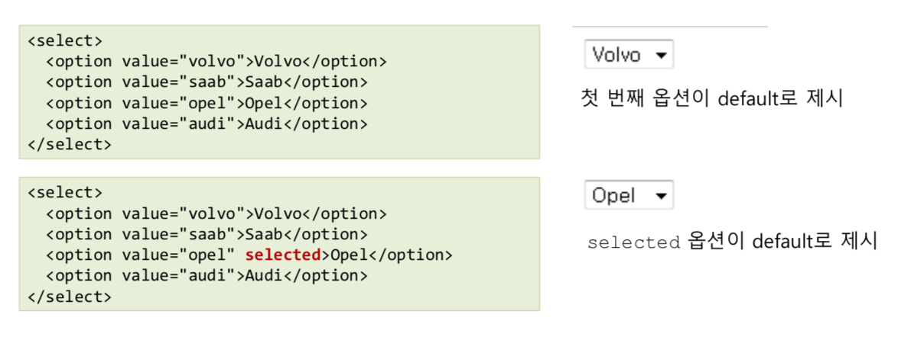

# 2. Form in HTML

html 안에는 웹 상에 본문을 보여주는 것 뿐만 아니라, 사용자의 입력도 받을 수 있다. 이런 입력들을 container 형식으로 묶어서 서버에 보낼 수 있게 끔 할 수 있는 것이 form tag이다.

## 2.1 Form tag

* form안에 사용자 입력 element들을 container 형식을 묶는다.
* __name__ : form의 이름을 지정할 수 있다.
* __method__ : 데이터를 보내기 위한 http 통신 방법을 지정할 수 있다. (GET, POST ..)
* __action__: 데이터를 보낼 서버의 target url 또는 파일 경로를 지정할 수 있다.

~~~html
<form action="action_page.php" name=“nickname” method=“GET”>
~~~
</img>

## 2.2 Input element

사용자 입력을 도와주는 요소이며, 여러 control이 존재한다.

### Form control

* Input field ``` <input type=“text” name=“fname”> ```
* Multiline text area ``` <textarea rows=“4” cols=“50”> ```
* Button ``` <button type=“button”> ```
* Dropdown list ``` <select> <option value=“tesla”> ```
* Fieldset (group related elements) 
``` <fieldset> ``` , ```<legend> ```
* Label for form control ``` <label> ```


### Text & Password

* __Type__ property => text , password(입력 문자가 '*' 로 보임, But 보안 X)
* __Size__ property => 입력 문자 길이, 입력 상자 크기

### Checkbox & radio button

* __Type__ property => checkbox
   * 복수개 선택 가능

* __Type__ property => radio
   * 하나만 선택 가능
   * 같은 name을 가진 radio들은 같은 group으로 인식됌
   * 초기 값을 설정해야함 => 없으면 브라우저에서 지정해줌 

~~~html
<input type=“checkbox” name=“likeAnimal” checked=“checked”>
~~~
~~~html
<input type=“radio” name=“gender” value=“male”>Male<br>
<input type=“radio” name=“gender” value=“female” checked =“checked”>Female
~~~

### Select

* 여러 개의 후보 중 하나를 선택
* 요소가 너무 많아 구분이 필요한 경우 ```<optgroup label=“group name”>```로 구분

~~~html
<select>
<optgroup label="Swedish Cars">
    <option value="volvo">Volvo</option>
    <option value="saab">Saab</option>
  </optgroup>
  <optgroup label="German Cars">
    <option value="mercedes">Mercedes</option>
    <option value="audi">Audi</option>
  </optgroup>
</select>
~~~

</img>

* __Multiple__ property => Multiple 선택을 가능하게 해 줌

~~~html
<select name=“car” multiple>
<option value="volvo">Volvo</option> 
<option value="saab">Saab</option>
<option value="opel">Opel</option> 
<option value="audi">Audi</option>
</select>
~~~

</img>

* __Selected__ property => 특정 항목을 지정할 수 있다.

</img>

* __Placeholder__ property
~~~html
<input type="text" ... placeholder="First name">
<input type="text" ... placeholder="Last name">
~~~

</img>

### Label

Form control의 문구를 붙여줌
* __For__ property => 지정하는 input id

~~~html
<form action="/action_page.php">
  <label for="male">Male</label>
  <input type="radio" name="gender" id="male" value="male"><br>
  <label for="female">Female</label>
  <input type="radio" name="gender" id="female" value="female"><br>
  <label for="other">Other</label>
  <input type="radio" name="gender" id="other" value="other"><br><br>
  <input type="submit" value="Submit">
</form>
~~~


