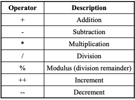
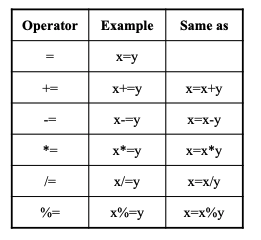
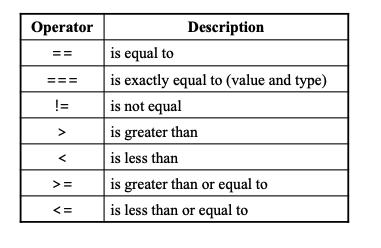

# 3. Javascript (Fundamentals)

## 3.1 자바스크립트란?


객체 기반의 스크립트 프로그래밍 언어이다. 웹 브라우저 내에서 주로 사용하며, 다른 응용 프로그램의 내장 객체에도 접근할 수 있는 기능을 가지고 있다. 또한 Node.js와 같은 런타임 환경과 같이 서버 사이드 네트워크 프로그래밍에도 사용되고 있다.

## 3.2 웹 브라우저에서 어떤 일을 하는가?

현재 자바스크립트는 편하고 간단한 프로그래밍 언어이다. 메모리나 cpu같은 low-level접근은 제공하지는 않는다. 브라우저 안에서 자바스크립트는 웹페이지를 다루는 일, 유저와 웹서버의 상호작용에 관련된 모든일을 할 수 있다.

예를 들어,
* HTML page 추가, content 변화, 스타일 수정
* 유저의 action의 반응, 마우스 클릭 또는 키보드 이벤트
* 서버의 request를 보내는 것, file 업로드, 다운로드
* 쿠키 생성
* localstrage의 데이터를 기억

## 3.3 Developer console

Chrome에서 지원하는 개발자 도구를 이용하여 javascript의 console을 사용할 수 있다. 이 console에서는 python console처럼 code(javacript)를 작성할 수 있으며, 만든 웹 페이지를 브라우저에 올릴 때, 버그가 있는 지도 확인할 수 있다. (단축키 F12)
또한 __현재 웹페이지의 DOM 객체에 접근도 가능하다.__


## 3.4 In-Broweser javascript

HTML file안에서 자바스크립트는 ```<script>...</script>``` 형식으로 자바스크립트를 명시해 줄 수 있다.
~~~html
<!DOCTYPE HTML>
<html>

<body>

</body>

<script>
...
</script>

</html>
~~~

또한 자바스크립트는 코드 뒤에 ';'를 있어도 되고 없어도 된다. 하지만 같은 라인에 구별되는 코드라면 ';'을 이용하여 분할한다.
예를 들어,

~~~javascript
alert('hello'); alert('world');
~~~
~~~javascript
alert('hello')
alert('world')
~~~
위에 두 코드는 같은 동작을 한다.


### Hello, World!

아래 코드는 웹브라우저에 'Hello, World!' 라는 알림을 보여준다.


```html
<!DOCTYPE HTML>
<html>

<body>

  <p>Before the script...</p>

  <script>
    alert( 'Hello, world!' );
  </script>

  <p>...After the script.</p>

</body>

</html>
```

## 3.5 Types, Values, and Variable

자바스크립트는 c언어와 java와는 다르게 모든 타입의 변수를 var 또는 let으로 선언할 수 있다. 변수 타입은 변수에 들어있는 데이터의 타입에 맞게 변환된다.

~~~javascript
let message;

message = 'Hello' // store the string
~~~

'message'라는 변수는 string type으로 변환된다.

var과 let말고도 const를 이용하여 변수를 선언할 수 있다.
const같은 경우는 한 번 초기화를 하면 안에 있는 변수의 값을 변경할 수 없게 된다.

~~~javascript
const message = 'Hello'

message = 'World' // Error
~~~


### Scope

자바스크립트에서 스코프란 어떤 변수들에 접글할 수 있는지를 정의한다. 크게 __전역 스코프__ 와 __지역 스코프__ 가 있다.


* __Global Sccope__ : 함수 밖에 선언된 변수는 전역 스코프로 정의되며, 모든 함수 안에서 이 변수를 접글할 수 있다.

* __Local Scope__ : 함수 안에 선언된 변수는 지역 스코프로 정의되며, 선언된 함수 안에서만 변수 접근이 가능하다.

### 호이스팅(Hoisting)

함수나 변수가 선언되면, 그 변수는 현재 스코프의 최상위 단으로 끌어 올라가게 된다.

예를 들어,
~~~javascript
// This is the same as the one below
sayHello()
function sayHello () {
  console.log('Hello CSS-Tricks Reader!')
}
~~~

~~~javascript
// This is the same as the code above
function sayHello () {
  console.log('Hello CSS-Tricks Reader!')
}
sayHello()
~~~

두 코드는 가능 기능을 하며, 선언식 위에서 아래에 선언된 변수나 함수를 사용할 수 있다.

반면 함수가 __함수 표현식(function expression)__ 으로 선언되면, 함수는 현재 스코프의 최상단으로 호이스팅되지 않는다.

~~~javascript
sayHello() // Error, sayHello is not defined
const sayHello = function(){
	console.log('function')
}
~~~

이렇게 두 방식의 행동이 다르기 때문에, 함수 호이스팅은 혼란스러울 수 있으므로 사용하기를 권장하지 않는다.

### Nested scopes

함수가 다른 함수 내부에서 정의되었다면, 내부 함수는 외부 함수의 변수에 접근할 수 있다. 반명, 외부 함수는 내부 함수의 변수에 접근할 수 없다.

~~~javascript
function outerFunction () {
  const outer = 'I’m the outer function!'
    
  function innerFunction() {
     const inner = 'I’m the inner function!'
     console.log(outer) // I’m the outer function!
  }
    
  console.log(inner) // Error, inner is not defined
}
~~~

### Closures

함수 내부에 함수들을 클로저라고 부른다. 이런 클로저는 차후에 외부 함수의 변수를 사용할 수 있기 때문에 대개 반환하여 사용한다.

~~~javascript
function outerFunction () {
  const outer = 'I see the outer variable!'
  function innerFunction() {
    console.log(outer)
  }
  return innerFunction
}
outerFunction()() // I see the outer variable!
~~~

### Lexical Scope

위에서 말했던 클로저를 사용하여 외부 변수의 life를 유지하여 사용할 수 있다는 것이다. 이것을 Lexical Scope라고 부른다.

~~~javascript
function outFunction(){
    let count=0
    return function innerFunction(){
        count++;
        console.log(count)
    }
}
let count = outFunction()
count()	//1
count()	//2
~~~

### Block Scope

위에서 말했던 var 과 let은 변수를 선언하는데에 사용한다고 하였다. 하지만 여기서 var 과 let의 차이점은 let은 Block Scope를 가진다는 것이다. Block Scope는 괄호 안에서의 변수 선언은 괄호밖에 변수에 영향을 끼치지 않는 것인데, 밑에 예시를 보면

~~~javascript
let foo = 'bar1';
console.log(foo); // bar1

if (true) {
  console.log(foo); // bar1
  foo = 'bar2';
  console.log(foo) // bar2
}
console.log(foo); // bar2
~~~
> Use var
~~~javascript
let foo = 'bar1';
console.log(foo); // bar1

if (true) {
  let foo = 'bar2';
  console.log(foo) // bar2
}
console.log(foo);  // bar1
~~~
> User let

이 처럼 내부에서 같은 이름의 변수를 var을 사용하여 선언하면 외부에서 선언된 변수를 덮어버린다. 하지만 let같은 경우는 block안에서만 life가 유지된다. 


## 3.6 Expressions and Operator

### Expressions
* Array => ```var a = [1, 1+2, 4];```
* Object => ```var p = {x:2.3 , y: -1.2};```
* Function => ```var squre = function(x) { return x*x;};```
* Property Accesss Expression => ```expression.identifier``` or ```expression[identifier]```
* Object Creation Expression => ```new Point(2,3)```

### Arithmetic Operators


### Assignment Operators


### Comparisons Operators


### Logical Operators

* && : and
* || : or
* ! : not

### String Operator

```javascript
txt1 = "What a ";
txt2 = "wonderful world";
txt3 = txt1 + txt2 // "What a wonderful world"
```

## 3.7 Statements

### Conditional Statements

* __if__
* __if..else__
* __if..else if...else__
* __{switch__


### Loops
* for
* while

```javascript
var txt = "";
var person = {fname: "john", lname:"Done", age:25);

for (var x in person){
	txt = txt + person[x];
}
console.log(txt) // johnDone25

```
```javascript
cars = ["BMW", "Volvo","Saab","Ford"];
for (var i=0; i<cars.length;i++)
{
	console.log(cars[i])
}
/*
BMW
Volvo
Saab
Ford
*/
```


## 3.8 Referenece

* __Scope__ : https://medium.com/@khwsc1/%EB%B2%88%EC%97%AD-%EC%9E%90%EB%B0%94%EC%8A%A4%ED%81%AC%EB%A6%BD%ED%8A%B8-%EC%8A%A4%EC%BD%94%ED%94%84%EC%99%80-%ED%81%B4%EB%A1%9C%EC%A0%80-javascript-scope-and-closures-8d402c976d19

